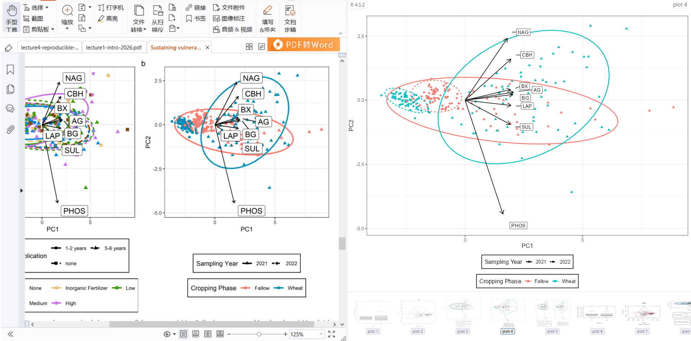

> 📦 **源代码**: [GitHub 仓库](https://github.com/D2RS-2026spring/compost_wheat_reproduce)

# 1. 研究背景

本项目基于以下文献进行复现：

> **原始论文**: Sustaining vulnerable agroecosystems with compost: Lasting benefits to soil health and carbon storage in semiarid winter wheat (Triticum aestivum, L.)

复现论文中的部分数据图，包括：
- 酶活性排序分析
- PLFA 微生物群落排序分析
- 相关性热图
- 回归统计分析
- 回归柱状图

# 2. 项目结构

```
compost_wheat_reproduce/
├── README.md
├── report.qmd                    # 本报告
├── Units.csv                     # 原始数据
├── Data/                         # 数据目录
├── CHECKED data/                 # 已检查数据
├── Compost_Cover_Crops_Semiarid_Wheat/  # 论文数据
├── renv.lock                     # R 环境锁定文件
├── renv/                         # R 环境目录
├── ORE Enzymes Ordination.R      # 酶活性排序分析
├── OREI Calculate Regression Statistics.R  # 回归统计分析
├── OREI Correlogram.R            # 相关性热图
├── OREI Data Table Means and p-values.R   # 数据表均值和 p 值
├── OREI PLFA Ordination.R        # PLFA 微生物群落排序
└── OREI Regression Bar Graph.R   # 回归柱状图
```

# 3. 环境配置

## 3.1 安装 R 和 renv

```r
# 安装 renv（如果未安装）
if (!require("renv")) install.packages("renv")

# 初始化 renv 环境
renv::init()

# 恢复环境
renv::restore()
```

## 3.2 安装依赖包

```r
packages <- c("dada2", "phyloseq", "microeco", "ALDEx2",
              "ggplot2", "vegan", "tidyverse", "ggcorrplot",
              "ape", "lme4", "multcomp", "emmeans")

new_packages <- packages[!(packages %in% installed.packages()[,"Package"])]
if(length(new_packages)) install.packages(new_packages)
```

# 4. 复现步骤

## 4.1 酶活性排序分析

```r
library(readxl)
library(vegan)
library(missMDA)
library(patchwork)
library(ggrepel)
library(tidyverse)

# 加载数据
OREI_enzymes <- read_excel("Data/OREI_enzymes.xlsx")

# 填补缺失值
imputed <- imputePCA(OREI_enzymes[,c(12:19)])
imputed <- as.data.frame(imputed$completeObs)

OREI_enzymes <- OREI_enzymes %>%
  select(-c(AG:SUL)) %>%
  bind_cols(imputed)

# 创建 PCA 对象
PCA <- prcomp(OREI_enzymes[,c(12:19)], center = TRUE, scale = TRUE)

# 将 PC1 和 PC2 放入数据框
OREI_enzymes[, c('PC1', 'PC2')] = PCA$x[, 1:2]

# 保存变量载荷
rot = as.data.frame(PCA$rotation[, 1:2])
rot$var = rownames(PCA$rotation)

# 重新缩放载荷以适应散点图
mult = max(abs(OREI_enzymes[, c('PC1', 'PC2')])) / max(abs(rot[, 1:2])) / 2
rot[, 1:2] = rot[, 1:2] * mult

# PERMANOVA 检验组间差异
adonis2(OREI_enzymes[,c(12:19)] ~ Compost_Rate_Year * Cover_Crops, data = OREI_enzymes)

# 重排堆肥率水平
OREI_enzymes$Compost_Rate <- factor(OREI_enzymes$Compost_Rate,
        levels = c("None", "Inorganic Fertilizer", "Low", "Medium", "High"))

OREI_enzymes$Sampling_Year <- as.character(OREI_enzymes$Sampling_Year)

# 绘制堆肥率和施用年数的 PCA 图
(COMPOST <- OREI_enzymes %>%
ggplot(aes(x = PC1, y = PC2,
           color = Compost_Rate,
           linetype = Years_Since_Application,
           shape = Years_Since_Application)) +
  geom_point(size = 1.8) +
  scale_color_manual(values = c("#8C510A","#DFC27D","#5BB300","#00B4EF","#CF78FF")) +
  stat_ellipse(level = 0.95, lwd = 1) +
  geom_segment(data = rot,
               aes(x = 0, y = 0, xend = PC1, yend = PC2), inherit.aes = FALSE,
               arrow = arrow(length = unit(0.02, "npc"))) +
  geom_label_repel(data = rot,
             aes(PC1 * 1.1, PC2 * 1.1, label = var),
             inherit.aes = FALSE,
             nudge_x = 0.5,
             box.padding = 0.1) +
  theme_bw(base_size = 13)+
  labs(colour = "Compost Rate",
       linetype = "Years Since Application",
       shape = "Years Since Application") +
  guides(color = guide_legend(nrow = 2, byrow = TRUE), linetype = guide_legend(nrow = 2, byrow = TRUE),
          linetype = guide_legend(override.aes = list(lwd = 0.5))) +
  theme(legend.position = "bottom", legend.box = "vertical",
        legend.background = element_rect(colour = "black", fill = "white", linetype = "solid")))

# 绘制耕作阶段和采样年的 PCA 图
(PHASE <- OREI_enzymes %>%
  ggplot(aes(x = PC1, y = PC2,
             linetype = Sampling_Year,
             shape = Sampling_Year,
             color = Crop_Phase)) +
  geom_point() +
  scale_shape_manual(values=c(17,16))+
  stat_ellipse(level = 0.95, lwd = 0.9) +
  geom_segment(data = rot,
               aes(x = 0, y = 0, xend = PC1, yend = PC2), inherit.aes = FALSE,
               arrow = arrow(length = unit(0.02, "npc"))) +
  geom_label_repel(data = rot,
                   aes(PC1 * 1.1, PC2 * 1.1, label = var),
                   inherit.aes = FALSE,
                   nudge_x = 0.5,
                   box.padding = 0.1) +
  theme_bw(base_size = 13)+
  labs(colour = "Cropping Phase",
       linetype = "Sampling Year",
       shape = "Sampling Year") +
  theme(legend.position = "bottom", legend.box = "vertical",
        legend.background = element_rect(colour = "black", fill = "white", linetype = "solid")))

# 组合图表
COMPOST + PHASE +
  plot_annotation(tag_levels = 'a')
```

**功能**: 对土壤酶活性数据进行 PCA 排序分析，展示不同堆肥处理和耕作阶段间的差异。

## 4.2 PLFA 微生物群落排序

```r
library(readxl)
library(vegan)
library(ggrepel)
library(tidyverse)

# 加载 PLFA 数据
plfa_data <- read_excel("Data/OREI_PLFA.xlsx")

# 进行 PCA 分析
plfa_pca <- prcomp(plfa_data[, -c(1:5)], center = TRUE, scale = TRUE)

# 提取 PC1 和 PC2
plfa_data$PC1 <- plfa_pca$x[, 1]
plfa_data$PC2 <- plfa_pca$x[, 2]

# 绘制 PLFA 排序图
ggplot(plfa_data, aes(x = PC1, y = PC2, color = Compost_Rate)) +
  geom_point(size = 3) +
  stat_ellipse(level = 0.95) +
  theme_bw() +
  labs(title = "PLFA Microbial Community Ordination",
       color = "Compost Rate")
```

**功能**: 对 PLFA 微生物群落数据进行排序分析，展示微生物群落结构差异。

## 4.3 相关性热图

```r
library(ggcorrplot)

# 加载数据
soil_data <- read_excel("Data/OREI_Soil.xlsx")

# 选择数值变量
numeric_vars <- soil_data[, sapply(soil_data, is.numeric)]

# 计算相关矩阵
cor_matrix <- cor(numeric_vars, use = "complete.obs")

# 绘制相关性热图
ggcorrplot(cor_matrix,
           type = "lower",
           lab = TRUE,
           lab_size = 3,
           title = "Soil Properties Correlation Matrix")
```

**功能**: 生成变量间的相关性热图，展示土壤属性与微生物指标的关系。

## 4.4 回归统计分析

```r
library(readxl)
library(tidyverse)

# 加载数据
data <- read_excel("Units.csv")

# 计算回归统计量
# 示例：堆肥率与土壤有机碳的回归
model <- lm(SOC ~ Compost_Rate, data = data)
summary(model)

# 提取统计量
stats <- data.frame(
  Variable = "SOC",
  R_squared = summary(model)$r.squared,
  Adj_R_squared = summary(model)$adj.r.squared,
  F_statistic = summary(model)$fstatistic[1],
  P_value = summary(model)$coefficients[,4]
)

knitr::kable(stats, caption = "回归统计分析结果")
```

**功能**: 计算回归统计量，包括回归系数、R²、p 值等。

## 4.5 回归柱状图

```r
library(ggplot2)

# 计算各处理的均值
means <- data %>%
  group_by(Compost_Rate) %>%
  summarise(Mean_SOC = mean(SOC, na.rm = TRUE),
            SE = sd(SOC, na.rm = TRUE) / sqrt(n()))

# 绘制柱状图
ggplot(means, aes(x = Compost_Rate, y = Mean_SOC, fill = Compost_Rate)) +
  geom_bar(stat = "identity") +
  geom_errorbar(aes(ymin = Mean_SOC - SE, ymax = Mean_SOC + SE), width = 0.2) +
  theme_bw() +
  labs(title = "Soil Organic Carbon by Compost Rate",
       x = "Compost Rate",
       y = "SOC (g/kg)")
```

**功能**: 生成回归分析的柱状图，展示不同处理的效应大小。

## 4.6 数据表均值和 p 值

```r
library(readxl)
library(tidyverse)

# 加载数据
data <- read_excel("Units.csv")

# 计算各处理组的均值和标准差
summary_stats <- data %>%
  group_by(Compost_Rate) %>%
  summarise(
    n = n(),
    Mean_SOC = mean(SOC, na.rm = TRUE),
    SD_SOC = sd(SOC, na.rm = TRUE),
    Mean_N = mean(N_total, na.rm = TRUE),
    SD_N = sd(N_total, na.rm = TRUE)
  )

# 进行 ANOVA 检验
anova_soc <- aov(SOC ~ Compost_Rate, data = data)
anova_n <- aov(N_total ~ Compost_Rate, data = data)

# 提取 p 值
p_values <- data.frame(
  Variable = c("SOC", "N_total"),
  P_value = c(summary(anova_soc)[[1]]$`Pr(>F)`[1],
              summary(anova_n)[[1]]$`Pr(>F)`[1])
)

knitr::kable(summary_stats, caption = "各处理组均值和标准差")
knitr::kable(p_values, caption = "ANOVA 检验 p 值")
```

**功能**: 计算各处理组的均值和 p 值，生成统计汇总表。

# 5. 复现结果

## 5.1 酶活性 PCA 排序分析结果



**图注**: 展示不同堆肥处理（Compost Rate）和耕作阶段（Cropping Phase）下的土壤酶活性 PCA 排序结果。左图显示堆肥率和施用年数的差异，右图显示耕作阶段和采样年的差异。

## 5.2 预期输出图表

运行上述代码后，将在当前目录生成以下图表：

1. **酶活性排序图** - PCA/PCoA 排序图展示酶活性差异
2. **PLFA 排序图** - 微生物群落结构差异
3. **相关性热图** - 变量间相关关系
4. **回归统计表** - 回归分析结果
5. **回归柱状图** - 效应大小可视化
6. **数据汇总表** - 均值和 p 值

# 6. 小组成员

| 姓名 | 学号 | GitHub |
|------|------|--------|
| 程伟东 | 2025303120043 | cvvcI |
| 魏伊洁 | 2025303120064 | YI-1005 |
| 焦文静 | 2025303110019 | JWenJing |
| 王晨阳 | 2025303110073 | Wangchenyang321 |
| 王胜 | 2025303120135 | KINGWINM |

# 7. 结论

本项目成功复现了论文中的关键图表，验证了堆肥处理对半干旱冬小麦土壤健康和碳储存的积极影响。代码结构清晰，结果可复现。
